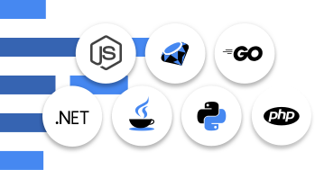
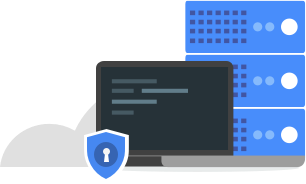
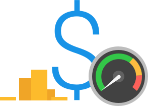

# GCP-Compute-AppEngine
- - - -

Fully managed serverless application platform

Build and deploy applications on a fully managed platform. Scale your applications seamlessly from zero to planet scale without having to worry about managing the underlying infrastructure. With zero server management and zero configuration deployments, developers can focus only on building great applications without the management overhead. App Engine enables developers to stay more productive and agile by supporting popular development languages and a wide range of developer tools.
- - - -
##### Open & familiar languages and tools

Quickly build and deploy applications using many of the popular languages like Java, PHP, Node.js, Python, C#, .Net, Ruby and Go or bring your own language runtimes and frameworks if you choose. Get started quickly with zero configuration deployments in App Engine. Manage resources from the command line, debug source code in production and run API backends easily using industry leading tools such as Cloud SDK, Cloud Source Repositories, IntelliJ IDEA, Visual Studio and Powershell.

##### Just add code

Focus just on writing code, without the worry of managing the underlying infrastructure. With capabilities such as automatic scaling-up and scaling-down of your application between zero and planet scale, fully managed patching and management of your servers, you can offload all your infrastructure concerns to Google. Protect your applications from security threats using App Engine firewall capabilities, Identity and Access Management (IAM) rules, and managed SSL/ TLS certificates.

##### Pay only for what you use

Choose to run your applications in a serverless environment without the worry of over or under provisioning. App Engine automatically scales depending on your application traffic and consumes resources only when your code is running. You will only need to pay for the resources you consume.

## App Engine Features
A powerful platform to build apps and scale automatically

#### Popular Languages
Build your application in Node.js, Java, Ruby, C#, Go, Python, or PHP—or bring your own language runtime

#### Open & Flexible
Custom runtimes allow you to bring any library and framework to App Engine by supplying a Docker container

#### Fully Managed
A fully managed environment lets you focus on code while App Engine manages infrastructure concerns

#### Monitoring, Logging & Diagnostics
Google Stackdriver gives you powerful application diagnostics to debug and monitor the health and performance of your app

#### Application Versioning
Easily host different versions of your app, easily create development, test, staging, and production environments

#### Traffic Splitting
Route incoming requests to different app versions, A/B test and do incremental feature rollouts

#### Application Security
Help safeguard your application by defining access rules with App Engine firewall and leverage managed SSL/TLS certificates* by default on your custom domain at no additional cost

#### Services Ecosystem
Tap a growing ecosystem of GCP services from your app including an excellent suite of cloud developer tools
- - - -

### Solutions & Use Cases
Modern web applications

Quickly reach your customers and end users by deploying your web apps on App Engine. With zero configuration deployments and zero server management, App Engine allows you to focus only on what matters the most - writing code. Support sudden traffic spikes by scaling up or down instantaneously, without having to worry about server management, provisioning, patching or monitoring - its all taken care of by App Engine. 

####  Scalable mobile backends

Whether you are looking to build your first mobile app or are looking to reach your existing users via a mobile experience, with App Engine, you can always be ready with a scalable backend that will scale from zero to infinite scale without a glitch. App Engine works seamlessly with Firebase, enabling you to leverage an easy-to-use front end mobile platform along with the scalable and reliable backend.

#cloud/gcloud/engineer_cert/GCP-DeepDive