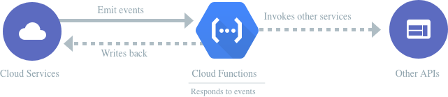
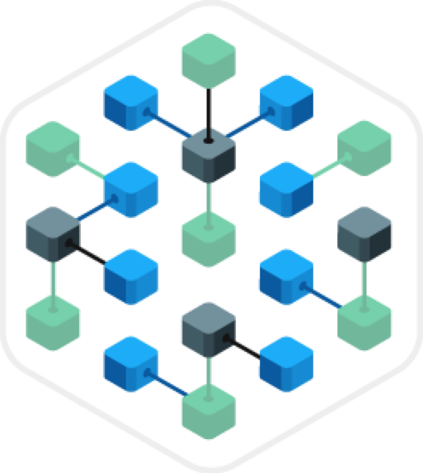

# GCP-Compute-CloudFunctions
- - - -
## Google Cloud Functions 
Event-driven serverless compute platform 


	1. Simplest way to run your code in the cloud
	2. Automatically scales, highly available and fault tolerant
	3. No servers to provision, manage, patch or update
	4. Pay only while your code runs
	5. Connects and extends cloud services

```bash
$ cat hello.js

exports.hello = (req, res) => {

  res.send(`Hello World!`); 

}

$ gcloud functions deploy hello --trigger-http

Deploying function..... done!

$ curl https://foo-bar.cloudfunctions.net/hello

Hello World!
```
- - - -

# How It Works


- - - -

#### Serverless applications on Google’s infrastructure
Cloud Functions lets application developers spin up code on demand in response to events originating from anywhere. Treat all Google and third-party cloud services as building blocks, connect and extend them with code, and build applications that scale from zero to planet-scale—without provisioning or managing a single server.


- - - -
#### What you can build with Cloud Functions
https://cloud.google.com/functions/use-cases/serverless-application-backends/?authuser=1
https://cloud.google.com/functions/use-cases/real-time-data-processing/?authuser=1
https://cloud.google.com/functions/use-cases/intelligent-applications/?authuser=1
- - - -
#### Microservices over monoliths
Your development agility comes from building systems composed of small, independent units of functionality focused on doing one thing well. Cloud Functions lets you build and deploy services at the level of a single function, not at the level of entire applications, containers, or VMs.


- - - -
### Features and benefits

### No server management
Deploy your code and let Google run and scale it for you. Cloud Functions abstracts away all the underlying infrastructure, so that you can focus on your code and build applications faster than ever before.

### Pay only while your code runs
Cloud Functions are ephemeral, spinning up on-demand and back down in response to events in the environment. Pay only while your function is executing, metered to the nearest 100 milliseconds, and pay nothing after your function finishes.

### Scales automatically
Serve users from zero to planet-scale without even thinking about any infrastructure. Cloud Functions automatically manages and scales underlying infrastructure with the size of workload.

### Runs code in response to events
Cloud Functions allows you to trigger your code from Google Cloud Platform, Firebase, and Google Assistant, or call it directly from any web, mobile, or backend application via HTTP.

### Connects and extends services
Cloud Functions lets you treat all GCP, Firebase, Google Assistant, and 3rd-party cloud services as building blocks, connect and extend them with code, and rapidly move from concept to production.

### Open and familiar
Cloud Functions are written in JavaScript and execute in a standard Node.js runtime environment. There are no new languages, tools, or frameworks to learn. All you need to do is bring code—including native libraries you bring to the platform.


#cloud/gcloud/engineer_cert/GCP-DeepDive