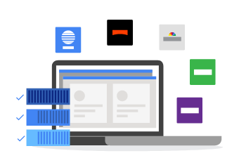

# GCP-Compute-Kubernetes
- - - -

#### Containerized Application Management at Scale

Kubernetes Engine is a managed, production-ready environment for deploying containerized applications. It brings our latest innovations in developer productivity, resource efficiency, automated operations, and open source flexibility to accelerate your time to market.

Launched in 2015, Kubernetes Engine builds on the learnings from Google’s experience of running services like Gmail and YouTube in containers for over 12 years. Kubernetes Engine allows you to get up and running with Kubernetes in no time, by completely eliminating the need to install, manage, and operate your own Kubernetes clusters.


#### Deploy a Wide Variety of Applications

Kubernetes Engine enables rapid application development and iteration by making it easy to deploy, update, and manage your applications and services. Kubernetes Engine isn’t just for stateless applications either; you can attach persistent storage, and even run a database in your cluster. Simply describe the compute, memory, and storage resources your application containers require, and Kubernetes Engine provisions and manages the underlying cloud resources automatically. Support for hardware accelerators makes it easy to run Machine Learning, General Purpose GPU, High-Performance Computing, and other workloads that benefit from specialized hardware accelerators.


- - - -

##### Operate Seamlessly with High Availability

Control your environment from the built-in Kubernetes Engine dashboard in Google Cloud console. Use routine health checks to detect and replace hung, or crashed, applications inside your deployments.Container replication strategies, monitoring, and automated repairs help ensure that your services are highly available and offer a seamless experience to your users. Google Site Reliability Engineers (SREs) constantly monitor your cluster and its compute, networking, and storage resources so you don't have to, giving you back time to focus on your applications.


- - - -

#### Scale Effortlessly to Meet Demand

Go from a single machine to thousands: Kubernetes Engine autoscaling allows you to handle increased user demand for your services, keeping them available when it matters most. Then, scale back in the quiet periods to save money, or schedule low-priority batch jobs to use up spare cycles. Kubernetes Engine helps you get the most out of your resource pool.


- - - -
#### Run Securely on Google’s Network

Connect to and isolate clusters no matter where you are with fine-grained network policies using Global Virtual Private Cloud (VPC) in Google Cloud. Use public services behind a single global anycast IP address for seamless load balancing. Protect against DOS and other types of edge attacks on your containers.


- - - -
#### Move Freely between On-premises and Clouds

Kubernetes Engine runs Certified Kubernetes ensuring portability across clouds and on-premises. There’s no vendor lock-in: you’re free to take your applications out of Kubernetes Engine and run them anywhere Kubernetes is supported, including on your own on-premises servers. You can tailor integrations such as monitoring, logging, and CI/CD using Google Cloud Platform (GCP) and third party solutions in the ecosystem.

- - - -
#### Deploy a Kubernetes Cluster and Update Production Code in Seconds 
```yaml
Welcome to the CI/CD with GKE tutorial terminal emulator!
In this tutorial, you will create a Kubernetes cluster on GKE, spin up a deploym
ent from Github, scale up the deployment, and update the codebase.
 
STEP 1: CREATE A CLUSTER
Enter the following command to create a cluster:
gcloud container clusters create k0
$ gcloud container clusters create k0

###

Creating cluster k0...done.
Created [https://container.googleapis.com/v1/projects/kubernetes-terminal-simula
tor/zones/us-west1-a/clusters/k0].
kubeconfig entry generated for k0.
NAME  ZONE        MASTER_VERSION  MASTER_IP       MACHINE_TYPE   NODE_VERSION  N
UM_NODES  STATUS
k0    us-west1-a  1.7.8-gke.0     192.0.2.113  n1-standard-1  1.7.8-gke.0   3   
       RUNNING
 
STEP 2: SPIN UP A DEPLOYMENT FROM GITHUB
Now let’s pull and execute a Kubernetes deployment from Github:
kubectl run app --image gcr.io/google-samples/hello-app:1.0
$ kubectl run app --image gcr.io/google-samples/hello-app:1.0
deployment "app" created
 
STEP 3: SCALE DEPLOYMENT
We should scale up the deployment across three pods for redundancy:
kubectl scale deployment app --replicas 3
$ kubectl scale deployment app --replicas 3

NAME                  READY     STATUS    RESTARTS   AGE
app-970732273-zce4e   1/1       Running   0          39s
app-970732273-bkfaa   1/1       Running   0          19s
app-970732273-b0n7k   1/1       Running   0          19s

deployment "app" scaled
 
STEP 4: OPEN PORTS
 
Now that the website is deployed, we are ready to open it up to the world:
kubectl expose deployment app --port 80 --type=LoadBalancer
$ kubectl expose deployment app --port 80 --type=LoadBalancer
service "app" exposed
 
STEP 5: CONFIRM DEPLOYMENT
Confirm service deployment:
$ kubectl get service app

app       LoadBalancer   198.51.100.105   203.0.113.217   80:31834/TCP   1m
 
STEP 6: CONFIRM AVAILABILITY
Confirm service is deployed and available:
$ curl http://203.0.113.217:80


Hello, world!
Version: 1.0.0
Hostname: app-970732273-b0n7k
 
STEP 7: UPDATE CODEBASE
Let’s imagine that the website has been updated and we need to deploy the update
d codebase to production -- it’s easy, just enter the following command:
$ kubectl set image deployment app app=gcr.io/google-samples/hello-app:2.0

deployment "app" image updated
 
STEP 8: CONFIRM UPDATE
Congratulations, your new website is up and running and automatically deployed t
o all running pods! Let’s confirm:
curl http://203.0.113.217:80

Hello, world!
Version: 2.0.0
Hostname: app-970732273-v0swh
 
TUTORIAL COMPLETE!
##

 

 

```

#cloud/gcloud/engineer_cert/GCP-DeepDive