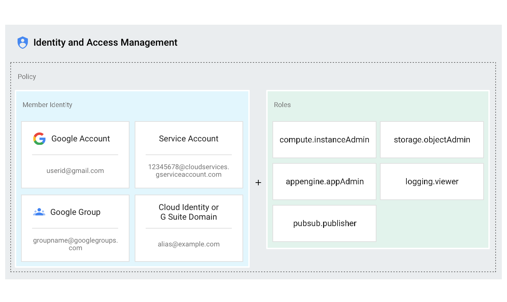
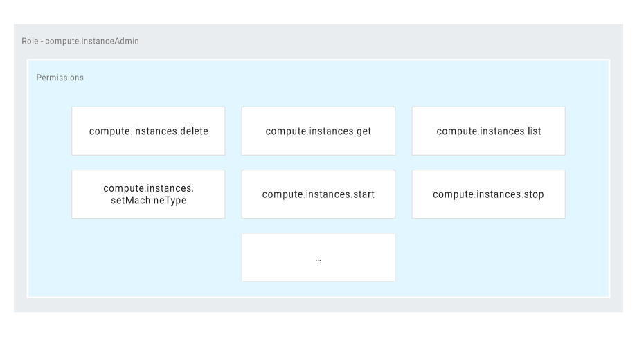
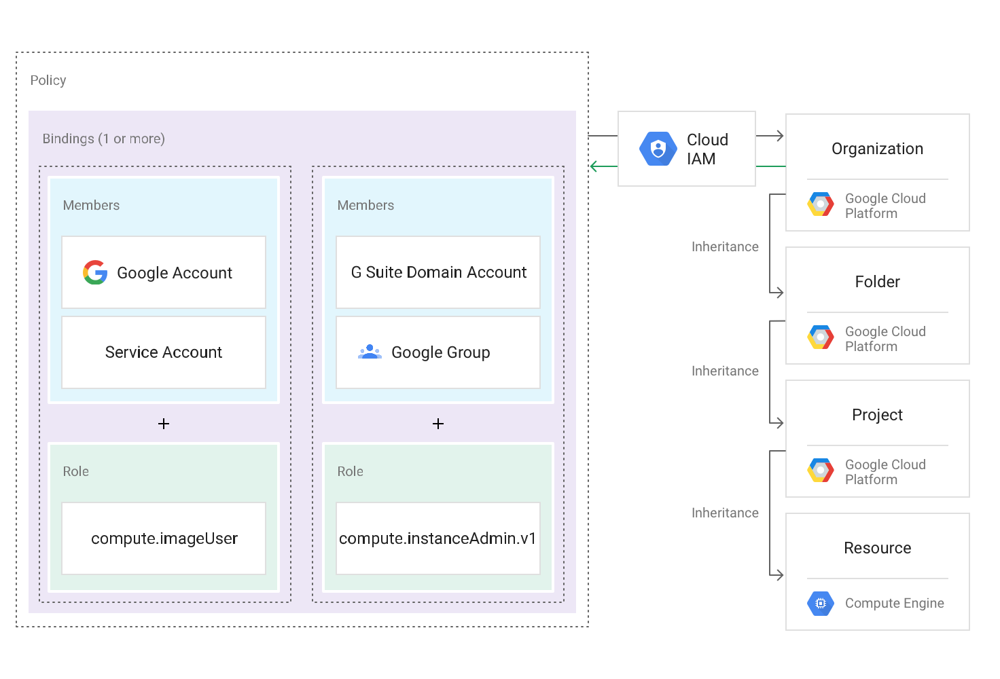
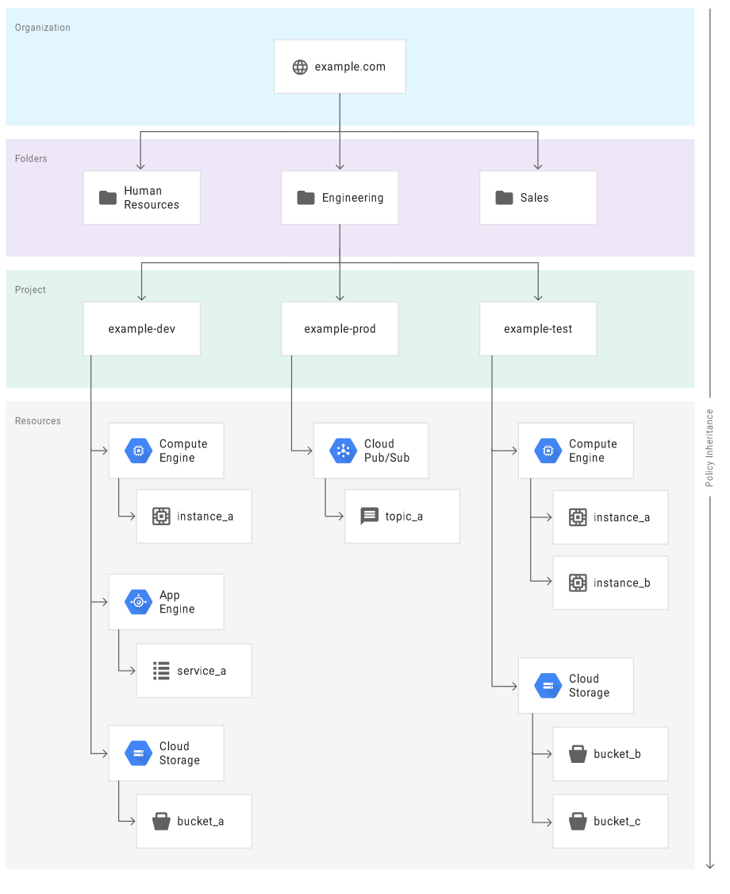

# IAM_GCP
- - - -
Todays Review

Google Cloud Platform (GCP) offers Cloud IAM, which lets you manage access control by defining who (identity) has what access (role) for which resource.

With Cloud IAM you can grant granular access to specific GCP resources and prevent unwanted access to other resources. Cloud IAM lets you adopt the security principle of least privilege, so you grant only the necessary access to your resources.

	* IAM & IAM Best Practises
			* Best Practises
				* Principal of least privilege 
					* Members should only have just enough permissions to perform their job role 
					* Use predefined roles over primitive roles 
					* Treat each app component as a separate trust boundary 
						* Create separate service account for each service 
					* Remember that child policies cannot overrule parent 
					* Grant roles at smallest scope necessary 
					* Restrict service account access 
					* Restrict who can create and manage service accounts 
					* Careful with owner roles(Editor might be better)
						* Owner can change IAM policy 
						* Audit tracking 		

				* Audit
					* Use Cloud Audit logs to regularly audit IAM policy changes 
					* Export audit logs to Cloud storage for long term retention 
					* Restrict accessess to logs 

				* Other Best Practices 
					*  When possible use groups 
					* Separate production and development environments 
	

	* Service Account 
		* Rotate service account keys(user managed)
					* NOTE don’t delete service in use by running instances 
					* Don’t check in service account keys to source code or leave in downloads directory 	
		* Authenticated gcloud account in different places 
		* Observe scopes 

- - - -
#####  Service Accounts and Scopes

	1. Within your project, create a regional storage bucket and upload a single file to it.

		* From left menu, go to Storage → Storage, and create a regional bucket with a unique name.
		*  When created, click on your bucket, and drag a file into the window.

	2. Within Compute Engine, create an instance and be sure that the Storage scope is set to Read Only, then SSH into it. 
		
		* Within the instance creation screen, go to Scope, choose option to manually set API access, and make sure Storage is set to Read Only. Click Create, then click the SSH button.

	3. View the gcloud configuration info for your instance session, note that the service account is the logged in entity.

    Type:
    `gcloud config list`

	4. From within the instance SSH session, view the contents of the storage bucket you’ve created.

    Type:
    `gsutil ls gs://(your_bucket_name)`

		5. Copy the file in the storage bucket to your instance directory.

    Type:
    `gsutil cp gs://(your_bucket_name)/* .  `
	 Note that you need the period at the end of the command.

		6. Create an empty text file in your instance, and attempt to copy the file to your storage bucket. Note the error.

    Type:
    `touch file.txt`
    `gsutil cp file.txt gs://(your_bucket_name)`

		7. Change the Storage scope of your instance from Read to Read Write.
		* Stop the instance, Edit the instance, change Storage scope from Read to Read Write. Save changes, and start instance again. Then SSH back into the instance.

	8. Attempt to copy the empty text file to your storage bucket again. It should work this time.

    Type:
    `gsutil cp file.txt gs://(your_bucket_name)`
——
- - - -
#### Concepts related to identity

In Cloud IAM, you grant access to members. Members can be of following types:

1. Google account
2. Service account
3. Google group
4. G Suite domain
5. Cloud Identity domain

#### Google account

A Google account represents a developer, an administrator, or any other person who interacts with GCP. Any email address that is associated with a Google account can be an identity, including gmail.com or other domains. New users can sign up for a Google account by going to the Google account signup page.

- - - -

#### Service account

A service account is an account that belongs to your application instead of to an individual end user. When you run code that is hosted on GCP, you specify the account that the code should run as. You can create as many service accounts as needed to represent the different logical components of your application. See the Google Cloud Platform Console Service Accounts documentation for more information.

- - - -

#### Google group

A Google group is a named collection of Google accounts and service accounts. Every group has a unique email address that is associated with the group. You can find the email address that is associated with a Google group by clicking About on the homepage of any Google group. For more information about Google groups, see the Google groups homepage.

Google groups are a convenient way to apply an access policy to a collection of users. You can grant and change access controls for a whole group at once instead of granting or changing access controls one-at-a-time for individual users or service accounts. You can also easily add members to and remove members from a Google group instead of updating a Cloud IAM policy to add or remove users.

Note that Google groups don't have login credentials, and you cannot use Google groups to establish identity to make a request to access a resource.

- - - -

#### G Suite domain

A G Suite domain represents a virtual group of all the Google accounts that have been created in an organization's G Suite account. G Suite domains represent your organization's Internet domain name (such as example.com), and when you add a user to your G Suite domain, a new Google account is created for the user inside this virtual group (such as username@example.com).

Like Google groups, G Suite domains cannot be used to establish identity, but they enable convenient permission management.

- - - -

#### Cloud Identity domain

A Cloud Identity domain is like a G Suite domain because it represents a virtual group of all Google accounts in an organization. However, Cloud Identity domain users don't have access to G Suite applications and features. For more information, see About Cloud Identity.

- - - -
## Concepts related to access management
#### Resource

You can grant access to users for a GCP resource. Some examples of resources are projects, Compute Engine instances, and Cloud Storage buckets.

Some services such as Cloud Pub_Sub support granting Cloud IAM permissions at a granularity finer than the project-level. For example, you can grant the Subscriber role to a user for a particular Cloud Pub_Sub topic. However, in most instances you grant Cloud IAM permissions for a project, and the permissions apply to all resources within the project. For example, to grant access to a Compute Engine instance or a Cloud Storage bucket, you must grant the access to the project that contains the instance or the bucket. For information on what roles can be granted on which resources, see Understanding Roles.

- - - -

#### Permissions

Permissions determine what operations are allowed on a resource. In the Cloud IAM world, permissions are represented in the form of <service>.<resource>.<verb>, for example pubsub.subscriptions.consume.

Permissions usually, but not always, correspond 1:1 with REST methods. That is, each GCP service has an associated set of permissions for each REST method that it exposes. The caller of that method needs those permissions to call that method. For example, the caller of Publisher.Publish() needs the pubsub.topics.publish permission.

You don't assign permissions to users directly. Instead, you assign them a Role which contains one or more permissions.

- - - -

#### Roles

A role is a collection of permissions. You cannot assign a permission to the user directly; instead you grant them a role. When you grant a role to a user, you grant them all the permissions that the role contains.

There are three kinds of roles in Cloud IAM:

    Primitive roles: The roles historically available in the Google Cloud Platform Console will continue to work. These are the Owner, Editor, and Viewer roles.

    Predefined roles: Predefined roles are the Cloud IAM roles that give finer-grained access control than the primitive roles. For example, the predefined role Pub_Sub Publisher (roles_pubsub.publisher) provides access to only publish messages to a Cloud Pub/Sub topic.

    Custom roles: Roles that you create to tailor permissions to the needs of your organization when predefined roles don't meet your needs.

- - - -

#### IAM Policy

You can grant roles to users by creating a Cloud IAM policy, which is a collection of statements that define who has what type of access. A policy is attached to a resource and is used to enforce access control whenever that resource is accessed.

- - - -

#### Policy hierarchy

GCP resources are organized hierarchically, where the organization node is the root node in the hierarchy, the projects are the children of the organization, and the other resources are the children of projects. Each resource has exactly one parent. See the Resource Manager Resource Hierarchy topic for more information.

The following diagram is an example of a GCP resource hierarchy:

#cloud/gcloud/engineer_cert/GCP-DeepDive